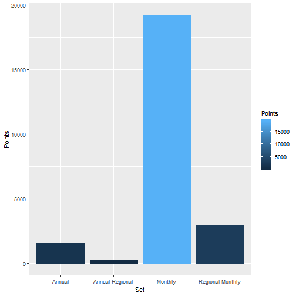

# Motivation
Visitors to a country have a huge beneficial impact on the countires they visit.

Gaining a better understanding of the following is important:
* Who is visiting; 
* When; and 
* Where they are from.

This allows businesses and people to prepare to meet visitors' needs.

Combined with long term trends, this application provides valuable insight into what the country has to prepare for to cater for future visitors.

It's important to note that some of the trends change over time.

---

# Data

Courtesy of the Australian Beureau of Statistics, the data is monthly from January 1991 until July 2018 with the lag for data availability being approximately 2 months.  It is categorised by regions and individual countries with significant numbers of visitors.

# Example Patterns of Interest

Annual 1991-2017 for Japan vs. China: A reversal of fortune for Japan while China powers ahead?

Annual 1991-2017 for New Zealand: A relatively steady increase.

Annual 1991-2017 for Indonesia: After a peak in 1997, arrivals declined rapidly and have only recovered in the last few years.

Monthly trends for 2016-2017 by Region:
* What months are most active?
* What months are least active?
* What regions are offset from major patterns? i.e. Total North-East Asia

---
# Shiny App

Available at https://marksmithau.shinyapps.io/DevelopingDataProductsShinyProject/

Allows easy viewing and comparison of countries

Summarisation annually or view monthly data

A plot of the data volumes for different options (calculated via embedded R) is on the next slide

Source for the Shiny application is at:
* https://github.com/MarkSmithAU/DevelopingDataProductsShinyProject

Source code for this presentation is at:
* https://github.com/MarkSmithAU/DevelopingDataProductsShinyPitch

------

The following plot gives a comparison of the number of points of data when using different options:

Thanks for your time :)
